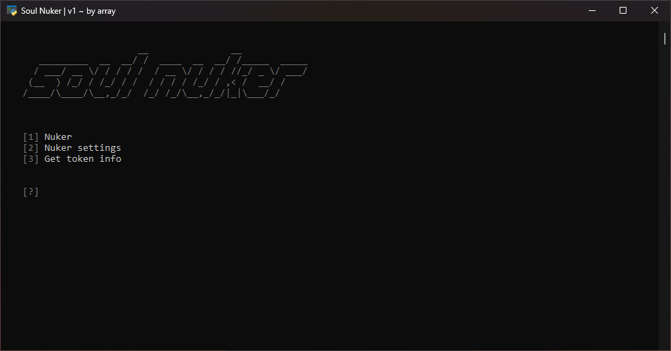

# Soul Nuker - made by array
### A casual discord nuker made in plain Python with requests.

## Features:
1. `Mass DM All Friends`
2. `Close All DMs`
3. `Delete All Friends`
3. `Mass Create Servers`
4. `Delete All Servers`
5. `Make Discord Flash`
6. `Get Token Info`

## Set-up | How to use

1. Run the `install.bat` file and wait for all the packages to be installed.
2. Open 'main.py'
3. And you're all set.

> If you have a lot of rate-limits, connect to a quality vpn or a proxy.

# Disclaimer

This is tool was made for educational purposes only. I'm not accountable for any action and any violation of ToS administered by a third party.

Also this tool was rushed and just don't judge all of the if statements :)))))))
